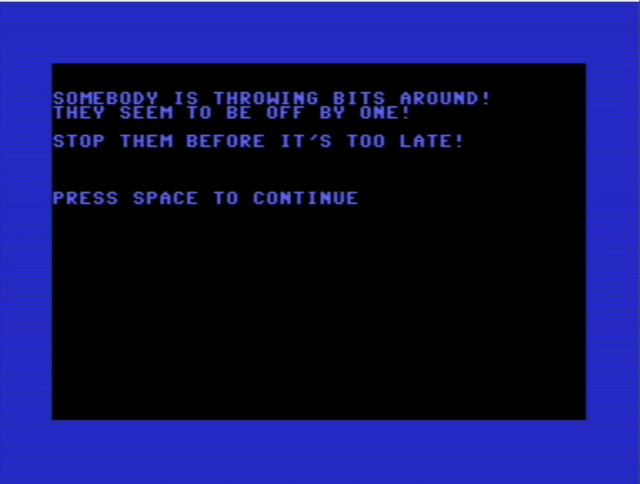

# Off-by-One

A Commodore 64 assembly demo built with KickAssembler, the VICE emulator, VSCode, and the VS64 extension.

Off-by-one is a common bug where a loop or index is one step too far or too short, causing a boundary miss or overrun.

## Requirements

There are many ways to set up a C64 development environment. This project uses the following tools:

- [VSCode](https://code.visualstudio.com/)
- [KickAssembler](https://theweb.dk/KickAssembler/Main.html#frontpage)
- [VICE emulator](https://vice-emu.sourceforge.io/)
- [VS64 extension](https://marketplace.visualstudio.com/items?itemName=almirvuk.vs64)

## Compile and Run

1) Open the project in VSCode.
2) Build with the VS64 KickAssembler task.
3) Launch the program using the VS64/VICE debug or run configuration.

Notes
- The VSCode tasks and launch configuration live in `.vscode`.
- Build output typically appears under `build/`.

## Contributing

This is just the demo that ads value to the blog post. We are not accepting contributions at this time. However, feel free to fork the project for your own experiments!

Code organization (src/)
- `main.asm` wires modules together and runs the main loop.
- `menu.asm` handles the intro/story screen and input gating.
- `game.asm` contains gameplay logic and per-game constants (ticks, colors, chars).
- `render.asm` owns screen/color RAM helpers and render constants.
- `vars.asm` defines zero-page/work variables and sizes for object/explosion arrays.
- `text.asm` holds story text strings.
- `constants.asm` is reserved for shared KERNAL addresses and globally used vectors.

Code conventions
- Constants live with the module that owns them; only shared KERNAL addresses stay in `constants.asm`.
- Variables are declared in `vars.asm` and use PascalCase labels (e.g., `PlayerX`, `ObjTickVal`).
- Routines use PascalCase labels and can use short local labels for flow (`Loop`, `Done`, etc.).
- Zero-page pointers use `ZP_*` names and are kept in render helpers.
- Temporary scratch values use `Temp*` names and are reused across modules.

## License

MIT. See `LICENSE.md`.
